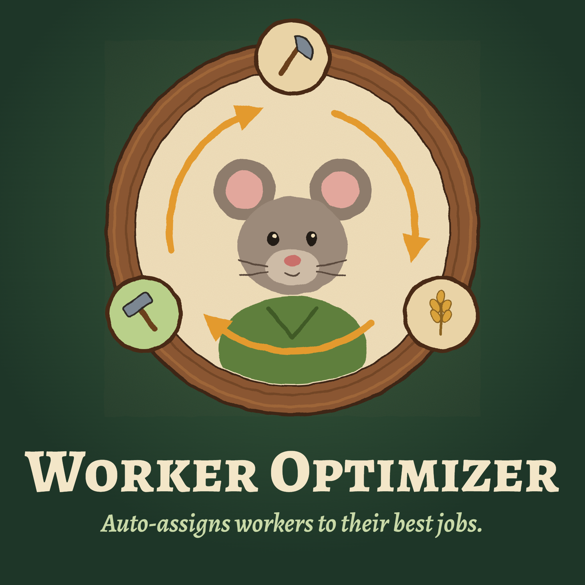

<div align="center">



# Worker Optimizer

**Auto-assign your Whiskerwood workers to suitable jobs with one click.**


[Steam Workshop](https://steamcommunity.com/sharedfiles/filedetails/?id=3814077514) · [GitHub release](https://github.com/repte/whiskerwood-worker-optimizer/releases/tag/v0.3.4-performance-preview) · [Preview notes](docs/releases/v0.3.4-performance-preview.md) · [Documentation](docs/GUIDE.md)

</div>

## At a Glance

- **One-click assignment:** evaluate your current settlement and assign workers from an icon in the gameplay HUD.
- **Better job matches:** consider each resident's guild specialty, productivity and job requirements.
- **Minimum crews first:** fill feasible minimum crews before adding suitable workers to extra positions.
- **Construction reserve:** keep residents available for building, using your saved reserve or **1 resident** by default.
- **Preserve protected workers:** leave paused buildings and unsupported warehouse workplaces unchanged.
- **Faster exact planning:** reduce repeated work without replacing the existing exact assignment approach.

## Play

Click the assignment icon in the lower-left corner. Worker Optimizer evaluates the current workforce, prioritizes minimum crews and then fills extra positions. The icon shows when assignment is running and becomes available again when the run ends.

The icon uses the same native gameplay-HUD visibility checks as the Campfire Panel mod: it belongs to the gameplay layer, hides in menus and while the HUD is hidden, loading or saving, and is not hidden merely by pausing the simulation or reaching the end of day. Hiding the icon does not cancel a running assignment.

> [!WARNING]
> For best results, run worker assignment calculations at night or just after a new day starts. Running them during the day may cause assignment errors.

> [!NOTE]
> **Version: v0.3.4-performance-preview**, targeting Whiskerwood **0.7.209.0 on Windows**. This preview is distributed through GitHub; Workshop publication is separate. Public in-game acceptance remains pending; use a separate save. See [preview details](docs/releases/v0.3.4-performance-preview.md).

Seven compiled planner benchmarks with **1,500 workers**, each repeated in three fresh processes, took **1.84-4.91 seconds** on the test machine. All 21 measurements were below five seconds, with unchanged checked assignments and objectives. Timing includes planner initialization, configuration and result checks, not the entire in-game operation, and is not a runtime guarantee for other hardware or settlements. The existing exact approach is retained, with no hybrid or approximate replacement. [Measurements and limits](docs/verification/2026-10-08-1500-planner.md).

## Install

**Steam Workshop:** [Worker Optimizer](https://steamcommunity.com/sharedfiles/filedetails/?id=3814077514) is updated separately. This GitHub release does not update the Workshop item. Restart the game after Steam downloads an update.

**Manual installation:** Use the packaged [WorkerOptimizer-v0.3.4-performance-preview.zip](https://github.com/repte/whiskerwood-worker-optimizer/releases/download/v0.3.4-performance-preview/WorkerOptimizer-v0.3.4-performance-preview.zip), not the source-code ZIP. Close the game and extract its `WorkerOptimizer` folder here:

```text
%LOCALAPPDATA%\Whiskerwood\Saved\mods\WorkerOptimizer\
  WorkerOptimizer.pak
  WorkerOptimizer.uplugin
```

No Python or Unreal Editor is needed. Use either the local package or the Workshop subscription, never both.

[Guide and troubleshooting](docs/GUIDE.md) · [Changelog](docs/CHANGELOG.md)

---

Unofficial community mod built with the [Whiskerwood modkit](https://github.com/Whiskerwood-Modding/Whiskerwood-Project) by Buckminsterfullerene and Whiskerwood-Modding. Game assets belong to their respective owners.

[MIT license](LICENSE) · [Third-party notices](THIRD_PARTY_NOTICES.md)

[](https://duoqueue.app/en/)
